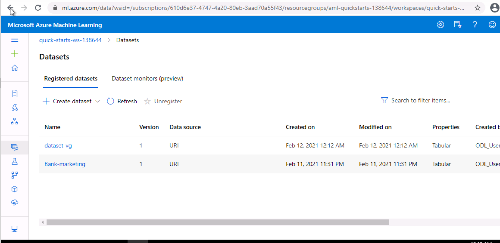
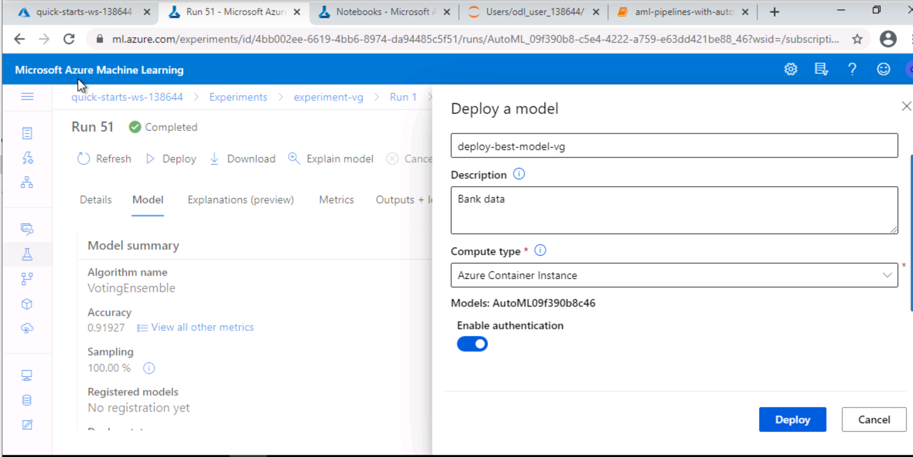
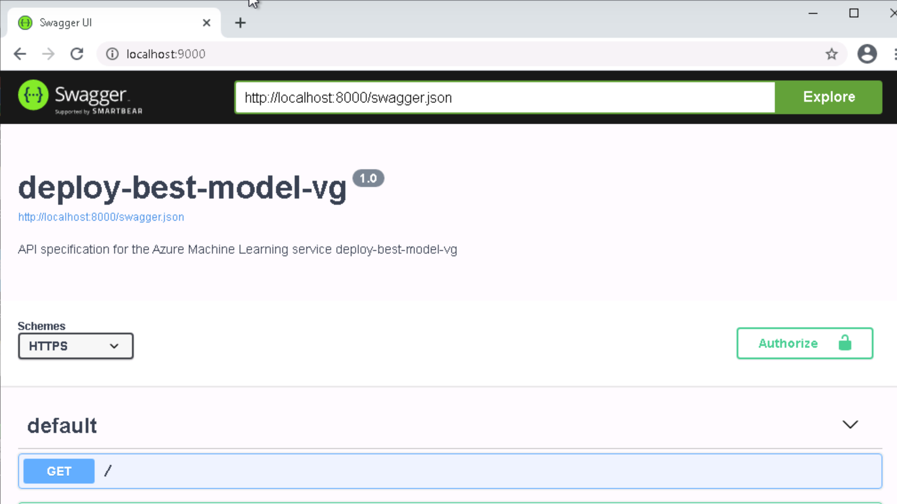
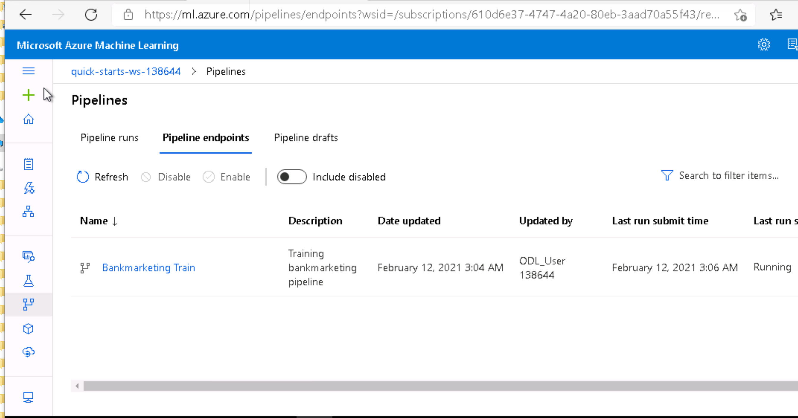

# Operationalizing Machine Learning

In this project Automated ML is used to find the best model for the given Bank Marketing dataset.
As required, I created an automl run to find the the best model,then model is deployed.
The application insigts are enabled  to obtain detailed information. A pipeline is also created
and it is published. 

These are seven major parts of the project:

1. Authentication

2. Automated ML Experiment

3. Deploy the best model

4. Enable logging

5. Swagger Documentation

6. Consume model endpoints

7. Create and publish a pipeline

## Architectural Diagram

## Major Seven Steps

##1. Authentication

A service principal is required to be created for authetication and security, but Udacity lab has already created it in the course-lab. 

##2.AutoML Experiment
The AutoML run creation started with compute cluster configuration with given specifications
of compute cluster VM size Standard_DS12_V2. Then it is configured with 1 as the
minimum umber of nodes. Then an Auto ML experiment is created
to find the best model. Dataset was uploaded to the compute.

The follwing screeshots shows the steps.
   
### Dataset
Bank Maeketing dataset has been uploaded and is available.

### Autom ML Experiment Completed, different AutoML models
This shows the list of different models through which the AutoML experiment has run through.
The AutoML experiment is completed. It shows the best model and the other models.

### Best Model
The best Model obtained through the AutoML experiment is Voting Ensemble. The accuracy of the model is 0.91958.

## 3. Deploy the best model

The best model, in this case, Voting Ensemble is deployed using Azure Container Instance(ACI)
deployment status is 'healthy'. 

##3. Deploying the best model
The model - Voting Ensemble is deployed using Azure Container Instances. The authentication is enabled.

## 4. Enable Logging 

Once the best model is deployed, we have to enable logging using the python file logs.py.
The application insights are made true for the deployed endpoints and to retrieve the log.
The following screenshots shows the logs.

### logs.py script and Applications insghts enabled to True
We choose the best model for deployment and enable "Authentication" while
deploying the model using Azure Container Instance (ACI). The executed code in logs.py
enables Application Insights. "Application Insights enabled" is disabled before executing logs.py.

## 5. Swagger Documentation 

In this step, swagger container is deployed in order to view the swagger documetation. For this the swagger.json file is downloaded. The swagger.sh and serve.py file is run. All these files should be in the same folder. The GET and POST request could be observed in the swagger UI. The below screenshots show the swagger documentation.

### Swagger.uri and swagger.json

The port number is updated and the swagger.sh file is executed.

### Running swagger.sh file, Running serve.py file

After executing swagger.sh file, the serve.py python file is executed on different port.

### Swagger documentation
The swagger UI is shown in the follwoing screeshot

### GET request

### POST request
POST request accepts json. The sample data tells us what type of data is being accepted. 

## 6. Consume Model Endpoints
Since the model is deployed, we can interact with the trained model.
 The endpoint.py file is used to show that the endpoint is consumed.
 The below screenshot shows the response that endpoint.py returns.
 

### Running endpoints.py file
After swagger documentation, the endpoints.py file is executed. The screenshot shows the output.

## 7. Create and Publish a Pipeline

In this step a pipeline is created. Jupyter notebook is used for AutoML run. config.json file is downloaded.
After setting the pipeline, the pipeline is run and late it is published which could be observed under
pipline endpoints. The follwoing screenshots shows the creation and publishing of the pipleine.

The screenshot shows the pipleine endpoint

### Pipeline Completed
The pipeline is completed

### Published Pipeline Overiew

### RunDetails Widget

### Pipeline REST Active points and scheduled Run

## Screen Recording
Link to the video of the project. [Video Link](https://youtu.be/SC2MRSfIcTc)

## Future Improvements
(i) Larger dataset can help to improve the model accuracy. (ii) Feature engineering can provide more info as it is sensitive financial data.

